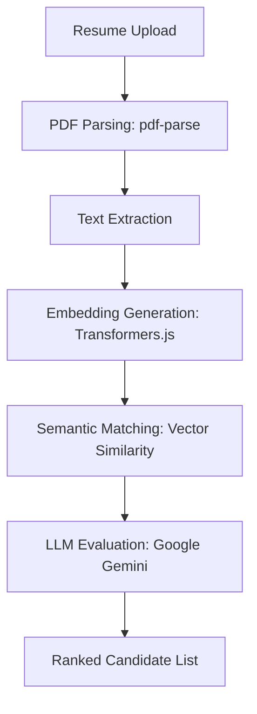

# 🚀 TalentBridge: AI-Powered Recruitment Ecosystem

**TalentBridge** is an advanced recruitment platform that leverages **Semantic Search** and **LLM-driven evaluation** to bridge the gap between top-tier talent and recruiters. By utilizing high-dimensional vector embeddings, it moves beyond traditional keyword matching to identify the best candidates through deep contextual understanding.

---

## 📖 Table of Contents
- [✨ Key Features](#-key-features)
- [🛠️ Tech Stack](#-tech-stack)
- [📐 System Architecture](#-system-architecture)
- [⚙️ Installation & Setup](#-installation--setup)
- [🔄 AI Workflow](#-ai-workflow)
- [📁 Project Structure](#-project-structure)
- [🛡️ Security Features](#-security-features)
- [🔮 Future Roadmap](#-future-roadmap)

---

## ✨ Key Features

### 👤 For Candidates
* **Smart Profiles:** Secure registration and profile management.
* **Resume Intelligence:** Instant PDF parsing and data extraction via AI.
* **Application Tracking:** Real-time status updates and historical tracking.

### 💼 For Recruiters
* **Job Management:** Simplified interface for posting and managing job lifecycles.
* **AI-Based Evaluation:** Automated candidate scoring using Google Generative AI.
* **Semantic Search:** Identify candidates based on skill intent rather than exact string matches.

---

## 🛠️ Tech Stack

| Layer | Technologies |
| :--- | :--- |
| **Frontend** | React, Vite, Material UI, Radix UI, Emotion |
| **Backend** | Node.js, Express.js, JWT, Multer |
| **Database** | MongoDB, Mongoose ODM |
| **AI / ML** | Transformers.js, Google Generative AI (Gemini), pdf-parse |

---

## 📐 System Architecture

TalentBridge utilizes a decoupled client-server architecture with a dedicated AI processing layer.


```text
Frontend (React + Vite) 
       │ 
       ▼ 
REST API (Node.js + Express) 
       │ 
       ├── Authentication (JWT) 
       ├── Job Management 
       ├── Application System 
       └── Semantic Search 
               │ 
               ▼ 
        MongoDB Database

AI Layer (Logic)
       ├── Resume Parsing (pdf-parse)
       ├── Embedding Generation (Transformers.js)
       └── Evaluation (Google GenAI)

```

---

## ⚙️ Installation & Setup

### 1. Clone the Repository

```bash
git clone [https://github.com/YOUR_USERNAME/TalentBridge.git](https://github.com/YOUR_USERNAME/TalentBridge.git)
cd TalentBridge

```

### 2. Configure Environment Variables

Create a `.env` file inside the `backend` folder:

```env
PORT=5000
MONGO_URI=your_mongodb_atlas_connection
JWT_SECRET=your_secret_key
GOOGLE_API_KEY=your_google_genai_key

```

### 3. Install Backend Dependencies

```bash
cd backend
npm install
npm start

```

### 4. Install Frontend Dependencies

```bash
cd ../frontend
npm install
npm run dev

```

---

## 🔄 AI Workflow

The platform treats resume data as high-dimensional vectors to ensure precision matching.



---

## 📁 Project Structure

```text
TalentBridge
├── backend
│   ├── controllers/    # API Request Handlers
│   ├── middleware/     # Auth & File Upload logic
│   ├── models/         # Mongoose Schemas
│   ├── routes/         # API Route definitions
│   ├── utils/          # AI logic & PDF parsing helpers
│   └── server.js       # Entry point
├── frontend
│   ├── components/     # Reusable UI elements
│   ├── pages/          # View components
│   ├── services/       # Frontend API calls
│   ├── assets/         # Static assets
│   └── main.jsx        # React DOM entry
└── README.md

```

---

## 🛡️ Security Features

* **Bcrypt:** Password hashing for data protection.
* **JWT:** Stateless authentication for secure API access.
* **Multer Filtering:** Validation of file types for secure resume uploads.
* **Env Protection:** Strict separation of API keys from the source code.

---

## 🔮 Future Roadmap

* [ ] **AI Interview Assistant:** Automated initial technical screenings.
* [ ] **Skill Graph:** Visualizing candidate skill density and growth.
* [ ] **Recruiter Analytics:** Data-driven dashboard for hiring metrics.

---

## 📄 License

Distributed under the **MIT License**.

*Copyright (c) 2026 Mukund Rakholiya*
