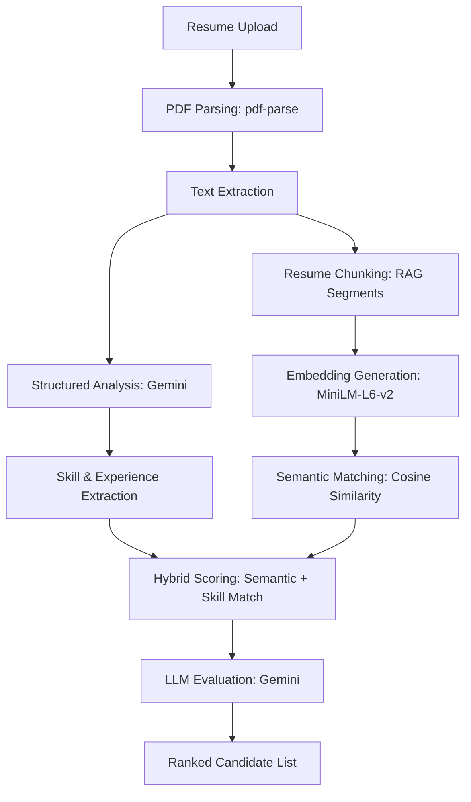

# 🚀 TalentBridge: AI-Powered Recruitment Ecosystem

**TalentBridge** is a full-stack recruitment platform that leverages **Semantic Search**, **LLM-driven evaluation**, and **live coding assessments** to bridge the gap between top-tier talent and recruiters. By utilizing high-dimensional vector embeddings and Google Gemini, it moves beyond traditional keyword matching to deliver deep contextual understanding across the entire hiring pipeline — from job posting to offer letter.

---

## 📖 Table of Contents
- [✨ Key Features](#-key-features)
- [🛠️ Tech Stack](#-tech-stack)
- [📐 System Architecture](#-system-architecture)
- [⚙️ Installation & Setup](#-installation--setup)
- [🔄 AI Workflow](#-ai-workflow)
- [📁 Project Structure](#-project-structure)
- [🔌 API Reference](#-api-reference)
- [🛡️ Security Features](#-security-features)
- [🚢 Deployment](#-deployment)
- [🔮 Future Roadmap](#-future-roadmap)

---

## ✨ Key Features

### 👤 For Candidates
* **Smart Profiles:** Secure registration, Google OAuth, and guided profile completion.
* **Resume Intelligence:** Instant PDF parsing and structured data extraction powered by Google Gemini with multi-model fallback.
* **Job Discovery:** Browse listings and apply with resume, cover letter, and portfolio links.
* **Application Tracking:** Real-time status updates with full status history.
* **Online Assessments:** Take MCQ and coding challenges with a built-in Monaco code editor supporting 7 languages.
* **Offer Management:** View, accept, or decline offer letters with PDF download.
* **Real-Time Messaging:** Direct communication with recruiters via Socket.io.
* **Google Calendar Integration:** Sync assessment and interview schedules.

### 💼 For Recruiters
* **Job Management:** Post, edit, and manage job listings with full lifecycle control.
* **AI-Based Evaluation:** Automated candidate scoring against job descriptions using Google Gemini.
* **Semantic Search:** Find candidates using natural language queries (e.g., *"Python backend developer with ML experience"*).
* **Hybrid ATS Search:** Combine semantic similarity with skill-matching and experience scoring for ranked candidate lists.
* **Assessment Builder:** Create MCQ and coding assessments with visible/hidden test cases.
* **Proctoring & Code Feed:** Monitor proctoring events and live code snapshots during assessments.
* **Offer Letters:** Generate and send offer letters with salary, benefits, and work details; downloadable as PDF.
* **Real-Time Messaging:** Communicate with candidates per application via Socket.io.
* **Google Calendar Integration:** Schedule assessments and interviews.

---

## 🛠️ Tech Stack

| Layer | Technologies |
| :--- | :--- |
| **Frontend** | React 18, TypeScript, Vite, Material UI, Radix UI, TailwindCSS, Emotion |
| **Code Editor** | Monaco Editor (in-browser IDE for assessments) |
| **Real-Time** | Socket.io (client + server) |
| **Backend** | Node.js, Express 5, JWT, Multer |
| **Database** | MongoDB, Mongoose ODM |
| **AI / ML** | Google Generative AI (Gemini 2.0/2.5/1.5 Flash), Transformers.js (MiniLM-L6-v2 embeddings) |
| **Code Execution** | Piston API (JavaScript, Python, TypeScript, Java, C++, C, Go) |
| **Auth** | JWT, bcryptjs, Google OAuth 2.0 |
| **Testing** | Vitest, React Testing Library |

---

## 📐 System Architecture

TalentBridge uses a decoupled client-server architecture with a dedicated AI processing layer and real-time communication.

```text
Frontend (React + Vite + TypeScript)
       │
       ▼
REST API (Node.js + Express 5)  ◄──► Socket.io (Real-Time Messaging)
       │
       ├── Authentication (JWT + Google OAuth)
       ├── Job Management
       ├── Application Pipeline
       ├── Online Assessment Engine
       ├── Offer Management
       ├── ATS (Applicant Tracking System)
       └── Semantic Search & RAG
               │
               ▼
        MongoDB Database

AI Layer
       ├── Resume Parsing & Analysis (Gemini + pdf-parse)
       ├── Job Requirement Extraction (Gemini)
       ├── Candidate Evaluation & Scoring (Gemini)
       ├── Embedding Generation (Transformers.js / MiniLM-L6-v2)
       ├── Resume Chunking for RAG Search
       └── Code Execution (Piston API)

External Services
       ├── Google Calendar API (Assessment Scheduling)
       └── Google OAuth 2.0 (Authentication)
```

---

## ⚙️ Installation & Setup

### 1. Clone the Repository

```bash
git clone https://github.com/YOUR_USERNAME/TalentBridge.git
cd TalentBridge
```

### 2. Configure Environment Variables

Create a `.env` file inside the `backend` folder:

```env
# Server
PORT=5000
NODE_ENV=development

# Database
MONGODB_URI=your_mongodb_atlas_connection

# Authentication
JWT_SECRET=your_jwt_secret
GOOGLE_CLIENT_ID=your_google_client_id
GOOGLE_CLIENT_SECRET=your_google_client_secret

# AI / ML
GEMINI_API_KEY=your_google_genai_key

# Optional
FRONTEND_URL=http://localhost:5173
PISTON_API_URL=https://emkc.run/api/v2/piston
GOOGLE_CALENDAR_TIMEZONE=Asia/Kolkata
```

### 3. Install & Start Backend

```bash
cd backend
npm install
npm start
```

### 4. Install & Start Frontend

```bash
cd ../frontend
npm install
npm run dev
```

The frontend will be available at `http://localhost:5173` and the backend API at `http://localhost:5000`.

---

## 🔄 AI Workflow

The platform treats resume data as high-dimensional vectors and leverages LLMs for intelligent evaluation.



---

## 📁 Project Structure

```text
TalentBridge/
├── backend/
│   ├── controllers/         # Business logic
│   │   ├── authController       # Auth, OAuth, token refresh
│   │   ├── jobController        # Job CRUD, semantic search
│   │   ├── applicationController # Application pipeline
│   │   ├── oaController         # Online assessments & code execution
│   │   ├── atsController        # ATS search, match, rank
│   │   ├── evaluationController # AI candidate evaluation
│   │   ├── offerController      # Offer letters & PDF generation
│   │   ├── messageController    # Real-time messaging
│   │   ├── resumeController     # Resume upload & parsing
│   │   ├── candidateController  # Candidate profiles
│   │   ├── recruiterController  # Recruiter management
│   │   └── ragSearchController  # RAG-based resume search
│   ├── models/              # Mongoose schemas
│   │   ├── User, Candidate, Recruiter
│   │   ├── Job, Application
│   │   ├── Assessment, AssessmentAttempt
│   │   ├── Message, Offer
│   │   └── ResumeChunk
│   ├── routes/              # Express route definitions
│   ├── middleware/          # JWT authentication middleware
│   ├── utils/               # AI & helper utilities
│   │   ├── candidateEvaluator   # Gemini-powered evaluation
│   │   ├── jobAnalyzer          # Job requirement extraction
│   │   ├── resumeAnalyzer       # Resume parsing (multi-model fallback)
│   │   ├── resumeChunker        # RAG document segmentation
│   │   ├── embedding            # Vector embedding generation
│   │   ├── codeRunner           # Piston API integration
│   │   ├── scoring              # Multi-factor candidate scoring
│   │   └── googleCalendar       # Calendar API integration
│   ├── migrations/          # Database migration scripts
│   └── server.js            # Entry point
├── frontend/
│   └── src/
│       ├── app/
│       │   ├── components/      # Reusable UI (headers, theme, Radix primitives)
│       │   ├── pages/           # Route-level views
│       │   ├── lib/
│       │   │   ├── redux/       # State management
│       │   │   └── parse-resume-from-pdf/  # Client-side PDF parsing
│       │   ├── routes.tsx       # Route definitions
│       │   └── App.tsx          # Root component
│       ├── utils/               # API client, auth, socket helpers
│       ├── styles/              # TailwindCSS, fonts, themes
│       ├── assets/              # Static images & logos
│       └── main.tsx             # React DOM entry point
├── guidelines/              # Project guidelines
├── render.yaml              # Render deployment config
└── README.md
```

---

## 🔌 API Reference

### Authentication — `/api/auth`
| Method | Endpoint | Description |
| :--- | :--- | :--- |
| POST | `/register` | Register new user |
| POST | `/login` | Login with credentials |
| POST | `/google` | Google OAuth login |
| GET | `/session` | Get current session (auth) |

### Jobs — `/api/jobs`
| Method | Endpoint | Description |
| :--- | :--- | :--- |
| GET | `/` | List all jobs |
| POST | `/create` | Create a job (auth) |
| GET | `/recruiter` | Get recruiter's jobs (auth) |
| GET | `/:id` | Get job details |
| DELETE | `/:id` | Delete a job (auth) |
| POST | `/semantic-search` | Semantic search jobs (auth) |

### Applications — `/api/applications`
| Method | Endpoint | Description |
| :--- | :--- | :--- |
| POST | `/apply` | Apply to job with resume (auth) |
| GET | `/my-applications` | Candidate's applications (auth) |
| GET | `/recruiter` | Recruiter's applications (auth) |
| GET | `/job/:jobId` | Applications for a job (auth) |
| PUT | `/:id/status` | Update status (auth) |
| PUT | `/bulk/status` | Bulk update statuses (auth) |

### Online Assessments — `/api/oa`
| Method | Endpoint | Description |
| :--- | :--- | :--- |
| POST | `/assessments` | Create assessment (auth) |
| GET | `/assessments/my` | Candidate's assessments (auth) |
| GET | `/assessments/:id` | Get assessment details (auth) |
| POST | `/assessments/:id/submit` | Submit assessment (auth) |
| POST | `/assessments/:id/run-tests` | Execute code tests (auth) |
| GET | `/assessments/:id/results` | Get results (auth) |
| GET | `/assessments/:id/code-feed` | Live code feed (auth) |
| POST | `/assessments/:id/proctor` | Log proctoring event (auth) |

### ATS — `/api/ats`
| Method | Endpoint | Description |
| :--- | :--- | :--- |
| POST | `/search-candidates` | Semantic candidate search (auth) |
| POST | `/hybrid-search` | Hybrid semantic + skill search (auth) |
| GET | `/match-candidates/:jobId` | Auto-match candidates (auth) |
| GET | `/rank/:jobId` | Rank candidates for job (auth) |

### Offers — `/api/offers`
| Method | Endpoint | Description |
| :--- | :--- | :--- |
| POST | `/send` | Send offer letter (auth) |
| GET | `/recruiter` | Recruiter's offers (auth) |
| GET | `/candidate` | Candidate's offers (auth) |
| PUT | `/:id/respond` | Accept or decline (auth) |
| GET | `/:id/pdf` | Download offer PDF (auth) |

### Messages — `/api/messages`
| Method | Endpoint | Description |
| :--- | :--- | :--- |
| POST | `/` | Send message (auth) |
| GET | `/conversations` | All conversations (auth) |
| GET | `/conversation/:applicationId` | Messages by application (auth) |
| PUT | `/:messageId/read` | Mark as read (auth) |

### Resume — `/api/resume`
| Method | Endpoint | Description |
| :--- | :--- | :--- |
| POST | `/upload` | Upload & parse resume (auth) |
| GET | `/` | Get resume data (auth) |
| DELETE | `/` | Delete resume (auth) |

### Candidate — `/api/candidate`
| Method | Endpoint | Description |
| :--- | :--- | :--- |
| GET | `/profile` | Get own profile (auth) |
| PUT | `/profile` | Update profile (auth) |
| GET | `/profile/:id` | Get candidate by ID (auth) |

---

## 🛡️ Security Features

* **Bcrypt:** Password hashing with bcryptjs for secure credential storage.
* **JWT:** Stateless token-based authentication for all protected API endpoints.
* **Google OAuth 2.0:** Secure third-party authentication with token refresh support.
* **Multer Filtering:** Validation of file types and size limits for resume uploads.
* **CORS:** Configured cross-origin resource sharing for frontend-backend communication.
* **Env Protection:** Strict separation of API keys and secrets from source code via dotenv.

---

## 🚢 Deployment

### Backend — Render
The backend is configured for deployment on [Render](https://render.com) via `render.yaml`:
- **Runtime:** Node.js
- **Build:** `npm install`
- **Start:** `node server.js`
- Set environment variables (`MONGODB_URI`, `JWT_SECRET`, `GOOGLE_CLIENT_ID`, `GEMINI_API_KEY`) in the Render dashboard.

### Frontend — Vercel
Deployed on Vercel, configured via `vercel.json` with SPA rewrites.

---

## 🔮 Future Roadmap

* [ ] **AI Interview Assistant:** Automated initial technical screenings with voice/video.
* [ ] **Skill Graph:** Visualizing candidate skill density and growth over time.
* [ ] **Recruiter Analytics:** Data-driven dashboard for hiring metrics and pipeline insights.
* [ ] **Multi-Language Assessment Support:** Expand coding challenge language options.
* [ ] **Email Notifications:** Automated status update and offer notifications.

---

## 📄 License

Distributed under the **MIT License**.

*Copyright (c) 2026 Mukund Rakholiya*
